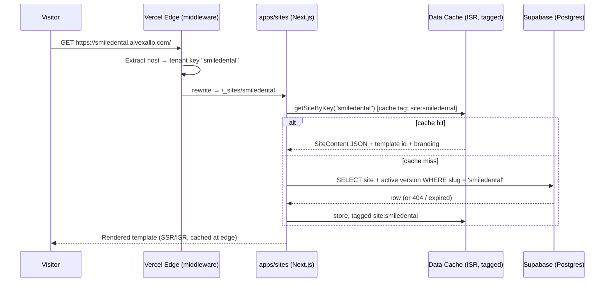

# Instant Business Website AI — Architecture

**Version:** 1.0 (Phase 0) · **Owner:** AIVEXA LLP · **Status:** Awaiting approval
**Companion document:** [SRS.md](./SRS.md)

---

## 1. Executive summary

Instant Business Website AI is an internal agency platform with two runtime surfaces built from one monorepo:

1. **`apps/admin`** — the internal dashboard (`app.aivexallp.com`). Lead CRM, AI website generator, deployment manager, outreach suite, analytics. Protected by Supabase Auth.
2. **`apps/sites`** — a single multi-tenant website renderer deployed once to Vercel with the wildcard domain `*.aivexallp.com`. Every demo and every converted client site is served by this one app.

The load-bearing decision is that **a "deployment" is a database row, not an infrastructure event**. Publishing a demo means activating a `sites` row and revalidating a cache tag. This makes deploys near-instant, free at the margin, and reversible — and it is the property every downstream module (tracking, expiry, conversion, custom domains) relies on.

---

## 2. The core decision: multi-tenant renderer

### 2.1 How it works



- **Middleware** (`apps/sites/middleware.ts`) reads the `Host` header. Subdomain of the base domain → tenant key is the slug. Any other host → tenant key is the full domain (custom client domains, resolved via the `domains` table). It rewrites to an internal route `/_sites/[tenant]/[...path]` — the URL bar never changes.
- **Rendering** uses ISR with **tag-based revalidation**: every DB read for a site is tagged `site:<slug>`. Publishing, editing, pausing, or expiring a site calls `revalidateTag('site:<slug>')`. Content changes are live in seconds; unchanged sites are served from cache indefinitely (no per-request DB load).
- **Publish** = set `sites.status = 'live'` + revalidate. **Pause/expire** = flip status + revalidate (renderer then shows a branded "demo expired" page). **Delete** = soft-delete row.
- **Custom domains** (Phase 14): Vercel Domains API attaches `www.clientdomain.com` to the *same* `apps/sites` project; a `domains` table row maps domain → site. SSL is automatic.

### 2.2 Trade-offs vs. alternatives

| | **A. Multi-tenant renderer (chosen)** | B. One Vercel project per demo | C. Static export per demo to storage/CDN |
|---|---|---|---|
| Time to live | Seconds (DB write + revalidate) | 2–5 min build each | ~1 min build + upload each |
| Cost at 100+ demos | One project; marginal cost ≈ 0 | Vercel project limits, per-build cost, unmanageable dashboard | Storage cheap, but build farm needed |
| Content edit → live | Instant (revalidate tag) | Full rebuild + redeploy | Full re-export |
| Central control (banner, expiry, tracking, noindex) | One code path controls all sites | Redeploy every site to change anything | Re-export every site |
| Demo expiry / pause | Flip a row | Delete deployments via API | Delete files |
| Tracking script rollout | Built into the renderer once | Per-site | Per-site |
| Custom client domains | Domains API on one project | Native but scattered | Complex |
| SaaS future | Add `org_id`; architecture unchanged | Dead end | Dead end |
| Blast radius | **A renderer bug affects all sites** | Isolated per site | Isolated per site |
| Template freedom | Templates are typed React components (by design) | Anything | Anything |
| DB dependency | Renderer needs Supabase up (mitigated by ISR cache) | None at runtime | None at runtime |

**Accepted risks and mitigations for option A:**

- *Single point of failure:* a bad renderer deploy breaks every demo. Mitigation: `apps/sites` is intentionally thin (it renders `SiteContent` JSON through versioned template components), Vercel instant rollback, and Phase 15 adds a Playwright smoke test that must pass before deploy.
- *Supabase outage:* ISR-cached pages keep serving; only cold slugs fail. Acceptable for demo sites; converted client sites get longer revalidation windows.
- *Noisy neighbor:* not a concern at internal scale; ISR isolates render cost per slug.

Options B and C are rejected: they optimize for isolation we don't need and give up the operational control (expiry, banners, tracking, instant edits) that the business model depends on.

### 2.3 Slug & domain resolution rules

- Reserved-word blocklist: `www`, `app`, `admin`, `api`, `mail`, `ftp`, `staging`, `dev`, `demo`, `assets`, `cdn`, `status`, plus a configurable list in settings.
- Slug: lowercase, `[a-z0-9-]`, 3–63 chars, unique across `sites` (enforced by DB unique index), auto-suggested from business name with numeric suffix on collision.
- Resolution order in middleware: exact custom domain match → subdomain slug match → 404 page.
- `noindex` header + meta while `sites.mode = 'demo'`; flipped on conversion.

---

## 3. Monorepo layout

Turborepo + npm workspaces. TypeScript strict everywhere, no `any`.

```
/apps
  /admin        → internal dashboard (Next.js 15 App Router, Supabase Auth)
  /sites        → multi-tenant renderer (Next.js 15, middleware host routing)
/packages
  /ui           → design system: Shadcn-based components, tokens, dark/light themes
  /templates    → website templates; each exports { meta, component } consuming SiteContent
  /db           → Supabase clients (server/browser/service), generated types, repositories
  /ai           → provider abstraction (Claude → Gemini → OpenAI-compat), prompt runtime,
                  structured-output + repair loop, usage logging
  /config       → shared constants, env validation (zod), category lists, scoring defaults
/supabase
  /migrations   → versioned SQL (schema, RLS, triggers, enums)
  /seed         → seed script + sample data
/docs           → SRS.md, ARCHITECTURE.md, RUNBOOK.md, ADDING_TEMPLATES.md
```

**Package boundary rules (enforced by ESLint import rules):**

- `apps/*` may import any package; packages never import from apps.
- `packages/templates` depends only on `packages/ui` + the `SiteContent` type — templates are pure functions of content, so they render identically in the admin preview iframe and the live renderer.
- `packages/ai` never touches the DB directly except through an injected usage-logger from `packages/db` (keeps it testable and provider-portable).
- The **`SiteContent` Zod schema** (in `packages/templates/schema`) is the single contract between AI generation, the section editor, version history, and the renderer. Everything serializes to it; nothing renders except through it.

**Two Vercel projects, one repo:** `admin` and `sites` are separate Vercel projects pointing at the same Git repo with different root directories. Turborepo's `--filter` scopes builds; a change to `packages/templates` redeploys both, a change to `apps/admin` redeploys only admin.

---

## 4. Data architecture

- **Table naming convention:** every application table is prefixed **`aiwebsite_`** (e.g. `aiwebsite_leads`, `aiwebsite_sites`). Postgres folds unquoted identifiers to lowercase, so the prefix is written lowercase; this namespaces the app cleanly inside the Supabase project. Enum types share the prefix (e.g. `aiwebsite_lead_status`).
- **Supabase Postgres** with versioned SQL migrations (no dashboard-drift). Enums as Postgres types. `updated_at` triggers, soft-delete columns (`deleted_at`), audit triggers on `aiwebsite_leads`, `aiwebsite_sites`, `aiwebsite_quotations`, `aiwebsite_payments`, `aiwebsite_settings`.
- **RLS on every table.** Today: policies allow `authenticated` internal users (role-checked via a `users.role` claim). Every policy is written as a single `is_org_member()`-style helper function so that adding `org_id uuid not null default <aivexa-org>` to tenant tables later converts the system to multi-tenant SaaS by changing the helper, not 24 policies.
- **Public surfaces** (tracking ingestion, form submissions) go through Route Handlers using the service-role key server-side with their own rate limiting and validation — anon key never gets insert rights on those tables.
- **Typed data layer:** `supabase gen types` output + hand-written repository functions in `packages/db` (one module per aggregate: leads, sites, outreach…). Apps never call `.from()` directly; repositories are the only query surface, which is what keeps the later `org_id` migration mechanical.
- Full ERD: see [SRS.md §6](./SRS.md).

---

## 5. AI engine architecture

```
generateSiteContent(lead, template, options)
  └─ PromptRuntime: category prompt (DB, versioned) + tone preset + bilingual flag
      └─ ProviderChain: Claude ──fail──▶ Gemini ──fail──▶ OpenAI-compatible
          each: retry ×2 w/ exponential backoff on 429/5xx, then fail over
      └─ StructuredOutput: parse → SiteContent.safeParse
          invalid → repair prompt with Zod error report (max 2 repair rounds) → hard fail
      └─ UsageLogger: provider, model, tokens in/out, latency, ₹ estimate, purpose, lead_id
```

- One `AIProvider` interface (`complete(request): Promise<Completion>`); Claude and Gemini adapters in Phase 6, OpenAI-compatible adapter is a config entry.
- All prompts live in the `aiwebsite_prompt_templates` table (per category, versioned, editable in Settings) — tuning output never requires a redeploy.
- Testimonials generated by AI are always labeled sample/generic — never real named people.
- Monthly budget from settings; dashboard widget + alert when 80% consumed.

---

## 6. Security architecture

- Supabase Auth (email + OTP), session cookies via `@supabase/ssr`; admin routes gated in middleware + server-side layout check (defense in depth).
- Roles: `owner` / `admin` / `viewer` in `users.role`, enforced in RLS and in server actions.
- Zod validation in every server action and route handler — client validation is UX only.
- Rate limiting (Upstash-style sliding window or Postgres-based) on: tracking ingest, form submissions, auth endpoints.
- AI output is data, not markup: `SiteContent` fields render as text through React (auto-escaped); any rich-text field is sanitized server-side before storage.
- Secrets only in env vars; API keys entered in Settings are encrypted at rest (AES-256-GCM with a server-side `SETTINGS_ENCRYPTION_KEY`) and never sent to the client.
- Signed upload flows for media; Razorpay and WhatsApp webhooks verify signatures; server actions rely on Next.js origin checks (CSRF-safe).
- Audit log on every mutation of critical tables (who, what, before/after diff).

---

## 7. External accounts, env vars & setup

### 7.1 Accounts needed (in order of when they block a phase)

| # | Service | Needed by | Setup steps |
|---|---------|-----------|-------------|
| 1 | **Supabase** | Phase 1 | Create project (region: `ap-south-1` Mumbai). Note project URL, anon key, service-role key. Enable email OTP auth provider. |
| 2 | **Vercel** | Phase 1 (admin), Phase 5 (sites) | Create team → two projects from the repo (`admin`, `sites`) with root dirs `apps/admin`, `apps/sites`. |
| 3 | **Domain `aivexallp.com`** | Phase 5/9 | **Wildcard subdomains on Vercel require Vercel nameservers.** At your registrar, change nameservers to `ns1.vercel-dns.com` / `ns2.vercel-dns.com`. Then in the `sites` project add domains: `aivexallp.com` and `*.aivexallp.com`; in the `admin` project add `app.aivexallp.com`. SSL (incl. wildcard cert) is automatic. Recreate any existing DNS records (e.g. MX for email) inside Vercel DNS before switching. |
| 4 | **Anthropic (Claude API)** | Phase 6 | console.anthropic.com → API key. Default model: `claude-sonnet-5` for content generation. |
| 5 | **Google AI (Gemini)** | Phase 6 | aistudio.google.com → API key (fallback provider). |
| 6 | **Cloudinary** | Phase 8 | Free tier → cloud name, API key/secret. Fallback path: Supabase Storage + `next/image`. |
| 7 | **Resend** | Phase 11 | resend.com → API key; verify sending domain `aivexallp.com` (SPF/DKIM records go into Vercel DNS). |
| 8 | **Razorpay** | Phase 14 | Business KYC → key id/secret; webhook secret for payment-link events. |
| 9 | **Google PageSpeed Insights API** | Phase 13 | Google Cloud console → enable PSI API → API key (free). |
| 10 | *(Optional)* **WhatsApp Business Cloud API** | Phase 11 (optional) | Meta developer app + business verification; phone number id + permanent token. `wa.me` deep links work with zero setup and remain the default. |

### 7.2 Environment variables

| Variable | App(s) | Source |
|---|---|---|
| `NEXT_PUBLIC_SUPABASE_URL` | admin, sites | Supabase |
| `NEXT_PUBLIC_SUPABASE_ANON_KEY` | admin, sites | Supabase |
| `SUPABASE_SERVICE_ROLE_KEY` | admin, sites (server only) | Supabase |
| `SUPABASE_DB_URL` | migrations/CI | Supabase |
| `NEXT_PUBLIC_BASE_DOMAIN` | admin, sites | `aivexallp.com` |
| `NEXT_PUBLIC_ADMIN_URL` | admin, sites | `https://app.aivexallp.com` |
| `SETTINGS_ENCRYPTION_KEY` | admin | generated 32-byte key |
| `ANTHROPIC_API_KEY` | admin | Anthropic console |
| `GEMINI_API_KEY` | admin | Google AI Studio |
| `OPENAI_COMPAT_BASE_URL` / `OPENAI_COMPAT_API_KEY` | admin (optional) | any OpenAI-compatible host |
| `CLOUDINARY_CLOUD_NAME` / `CLOUDINARY_API_KEY` / `CLOUDINARY_API_SECRET` | admin | Cloudinary |
| `RESEND_API_KEY` | admin | Resend |
| `RAZORPAY_KEY_ID` / `RAZORPAY_KEY_SECRET` / `RAZORPAY_WEBHOOK_SECRET` | admin | Razorpay |
| `VERCEL_API_TOKEN` / `VERCEL_PROJECT_ID_SITES` / `VERCEL_TEAM_ID` | admin | Vercel (Domains API, Phase 14) |
| `PAGESPEED_API_KEY` | admin | Google Cloud (Phase 13) |
| `CRON_SECRET` | admin | generated; validates Vercel Cron calls |
| `WHATSAPP_CLOUD_TOKEN` / `WHATSAPP_PHONE_NUMBER_ID` | admin (optional) | Meta |

API keys that are business-configuration (AI keys, Cloudinary, Resend, Razorpay) can *also* be stored encrypted in the Settings table; env vars act as the bootstrap/default. `SUPABASE_SERVICE_ROLE_KEY`, `SETTINGS_ENCRYPTION_KEY`, and `CRON_SECRET` are env-only, never in DB.

---

## 8. Cross-cutting conventions

- **Mutations:** Server Actions with Zod-parsed inputs returning a typed `ActionResult<T>`; webhooks/tracking/public forms use Route Handlers.
- **Background jobs:** Vercel Cron → route handlers guarded by `CRON_SECRET` (daily digest, demo expiry, renewal reminders, purge job).
- **UI:** Shadcn + design tokens in `packages/ui`; every screen responsive, dark/light, keyboard accessible; empty/loading/error states are part of "done".
- **Observability:** `aiwebsite_audit_logs` table, AI usage logs, deployment logs; Sentry optional in Phase 15.
- **Testing:** Zod schemas double as fixtures factories; Playwright E2E happy path in Phase 15 (import → generate → deploy → track → convert).

## 9. Decision record (summary)

| # | Decision | Why |
|---|----------|-----|
| ADR-1 | Multi-tenant renderer, deploy = DB row | Seconds-to-live, zero marginal cost, central control (§2.2) |
| ADR-2 | Turborepo monorepo, two Vercel projects | Shared `SiteContent`/templates/db code with independent deploys |
| ADR-3 | `SiteContent` Zod schema as single contract | AI, editor, versioning, renderer all speak one validated shape |
| ADR-4 | Templates = typed React components, not AI layouts | Consistent design system; variants prevent identical demos |
| ADR-5 | Prompts stored in DB, versioned | Tune AI output without redeploying |
| ADR-6 | Repositories-only data access + RLS helper function | Makes future `org_id` multi-tenancy a mechanical change |
| ADR-7 | Tag-based ISR revalidation per slug | Instant publish/edit with near-zero DB load per request |
| ADR-8 | `wa.me` manual mode default; Cloud API optional | Zero-setup outreach on day 1; API is an upgrade, not a dependency |
