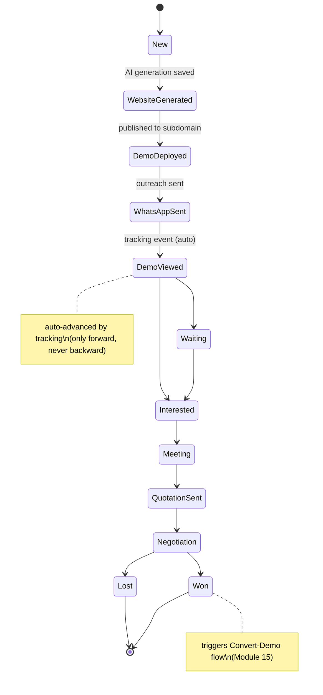
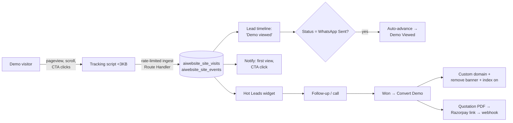
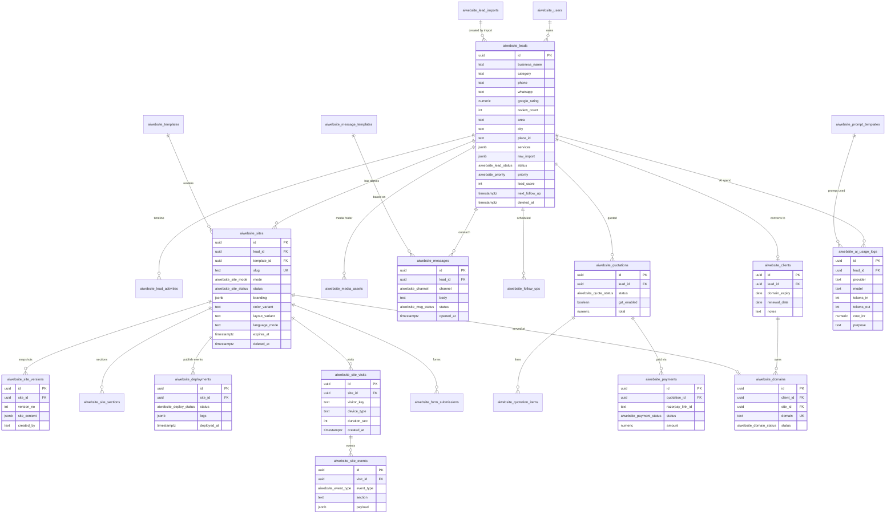

# Instant Business Website AI — Software Requirements Specification (SRS)

**Version:** 1.0 (Phase 0) · **Owner:** AIVEXA LLP · **Status:** Awaiting approval
**Companion document:** [ARCHITECTURE.md](./ARCHITECTURE.md)

---

## 1. Introduction

### 1.1 Purpose
Internal platform for AIVEXA LLP to generate premium demo websites for local businesses in minutes, deploy them instantly on `*.aivexallp.com` subdomains, pitch them via WhatsApp/email, track owner engagement, and convert interested owners into paying clients on their own domains.

### 1.2 Scope
Single-tenant internal tool (AIVEXA team only), architected so adding `org_id` later enables multi-tenant SaaS without refactoring. Two runtime apps: **admin dashboard** and **multi-tenant sites renderer** (see ARCHITECTURE.md).

### 1.3 Actors
| Actor | Description |
|---|---|
| **Owner** | AIVEXA principal. Full access incl. settings, keys, team management. |
| **Admin** | Team member. Full CRM/generator/outreach access; no settings/keys. |
| **Viewer** | Read-only access (future-ready role). |
| **Demo visitor** | Business owner (or public) viewing a demo site. Unauthenticated. |
| **System** | Cron jobs, webhooks, AI providers, tracking ingest. |

### 1.4 Definitions
- **Lead** — a local business prospect in the CRM.
- **Site** — a generated website record; renders at a subdomain (demo) or custom domain (converted).
- **SiteContent** — the typed, Zod-validated JSON contract holding all content/branding for one site.
- **Demo mode** — site state with AIVEXA banner, `noindex`, expiry countdown.
- **Hot lead** — lead whose demo was viewed within the last 48h, ranked by view count.

### 1.5 Database naming convention
**Every table is prefixed `aiwebsite_`** (lowercase — Postgres folds unquoted identifiers), e.g. `aiwebsite_leads`, `aiwebsite_sites`. Enum types share the prefix (e.g. `aiwebsite_lead_status`). This applies to all migrations, RLS policies, triggers, and generated types.

---

## 2. Lead lifecycle (state machine)

Any status → `Lost` or `Deleted` (soft) is allowed manually. Every transition writes an `aiwebsite_lead_activities` row.

---

## 3. Functional requirements by module

Format: user stories (**US-n.n**) + acceptance criteria (**AC**). "I" = Owner/Admin actor.

### Module 1 — Dashboard
- **US-1.1** As owner, I see KPI cards (total leads, demos live, WhatsApp sent, demo views this week, interested, won, revenue pipeline) so I know business health at a glance.
- **US-1.2** I see a **Hot Leads** widget (demos viewed in last 48h, sorted by view count) so I call the right people first.
- **US-1.3** I see today's pending follow-ups, a recent-activity feed, and this month's AI cost (tokens + ₹).
- **US-1.4** I press **Cmd+K** anywhere and search leads, sites, deployments.

**AC:** KPIs match DB aggregates; hot-leads widget updates within 60s of a tracked view; Cmd+K returns results across entities in <500ms; all widgets have loading/empty/error states; dark/light verified.

### Module 2 — Lead CRM
- **US-2.1** I create/edit leads with the full field set (identity, contact, socials, Google rating/reviews, geo, services, hours, tags, priority, score, follow-up dates, status).
- **US-2.2** I **bulk-import CSV/JSON** with column-mapping UI, preview, validation report, duplicate detection (phone / place_id), import history. Extra/unknown columns (40+ col files) are preserved in a raw JSON field, never rejected.
- **US-2.3** I switch between **Table** (sort/filter/column visibility/saved views), **Kanban** (drag-drop status), and **Map** (pins colored by status) views.
- **US-2.4** Lead detail shows an auto-logged **activity timeline** (status changes, messages, demo views, notes).
- **US-2.5** I merge duplicates field-by-field; activities from both are unified.
- **US-2.6** Leads are auto-scored 0–100 by `rating × reviews × has-no-website × category-weight` with weights editable in Settings.
- **US-2.7** Every row has quick actions: Generate Website / Send WhatsApp / Add Follow-up / Change Status. Soft delete + restore.

**AC:** Import of a 50-row, 40-column CSV completes with per-row validation report and dedupe prompt; Kanban drag persists status + timeline entry; score recomputes on relevant field change; saved filters (e.g. "Karol Bagh dentists") persist per user; deleted leads restorable from a trash view.

### Module 3 — Website Generator
- **US-3.1** Flow: select lead → template + color/layout variant → AI generates full `SiteContent` → preview → edit → deploy, in **under 3 minutes**.
- **US-3.2** Every section (hero, about, services, FAQs…) has **Edit** and **Regenerate with AI** (with optional instruction, e.g. "make it more premium").
- **US-3.3** **Device preview** iframe: mobile / tablet / desktop toggle before deploying.
- **US-3.4** **Bilingual**: English-only, Hindi-only, or bilingual (EN primary + Hindi toggle on the live site).
- **US-3.5** Every regeneration creates a **version**; I roll back any section or the whole site.
- **US-3.6** **Clone**: duplicate a site to another lead, swapping only business identity (name, logo, colors, services, phone, address, socials, images).

**AC:** Generation output always validates against `SiteContent` Zod schema (repair loop, max 2 retries, then actionable error); section regenerate touches only that section; version list shows diff-at-a-glance and restores atomically; clone produces a deployable site with zero leftover source-business strings.

### Module 4 — Template Library
- **US-4.1** Templates are typed React components fed by `SiteContent` — never free-form AI layouts.
- **US-4.2** Each template ships 3–4 color-scheme variants and 2 layout variants.
- **US-4.3** Gallery in admin with live preview per template/variant.
- **US-4.4** Launch set: Dental, Restaurant, Salon, Gym, General Business. Adding a template = one new file/folder in `packages/templates` + registry entry (documented in `docs/ADDING_TEMPLATES.md`).

**AC:** Same `SiteContent` renders correctly in all variants; two sites from the same template with different variants are visually distinct; a new template requires no changes to renderer or editor code.

### Module 5 — Generated Website Features
Every site includes: sticky header, animated hero, About, Services, Gallery, Testimonials (labeled sample), FAQs, Google Reviews section (rating/count/snippets from lead data), contact form, appointment form (stored + notification), click-to-call, floating WhatsApp button, Google Map embed, social links, opening hours, footer, privacy policy, terms, 404.

SEO/Tech: SSR/ISR, meta/OG/Twitter tags, **auto-generated OG image**, Schema.org LocalBusiness JSON-LD (geo/hours/rating), robots.txt + sitemap.xml per site, lazy loading, `next/image`, WCAG AA, Core Web Vitals optimized.

Demo mode: AIVEXA banner with WhatsApp link (removed on conversion), `noindex` (flipped on conversion), expiry countdown after N days (default 14, configurable), auto-archive by cron on expiry.

**AC:** Form submissions stored in `aiwebsite_form_submissions` + notify; JSON-LD validates in Google Rich Results test; demo pages send `X-Robots-Tag: noindex`; expired demo shows branded expiry page; Lighthouse ≥ 95 on templates.

### Module 6 — AI Content Engine
- **US-6.1** Provider chain Claude → Gemini → OpenAI-compatible with retry/backoff and automatic failover.
- **US-6.2** Structured JSON output validated against `SiteContent`; auto-repair loop (max 2).
- **US-6.3** **Prompt Template Manager**: per-category system prompts stored in DB, editable in UI, versioned.
- **US-6.4** Every call logged: provider, model, tokens in/out, latency, ₹ estimate, purpose, lead_id. Dashboard chart + monthly budget alert.
- **US-6.5** Tone presets: Premium / Friendly / Medical-professional / Luxury.

**AC:** Kill primary provider key → generation still succeeds via fallback and logs the failover; invalid JSON triggers repair, not a crash; editing a prompt creates a new version and old versions are viewable/restorable; budget alert fires at 80%.

### Module 7 — Branding Engine
Auto-generates per site: category-aware color palette (WCAG-contrast-checked), Google Fonts pairing from a curated list, icon/button/card styles. All manually overridable. **Logo fallback**: styled initials badge when no logo uploaded.

**AC:** Generated palettes always pass WCAG AA contrast for text/background pairs; overrides persist through regeneration; initials logo renders in header, favicon, and OG image.

### Module 8 — Media Library
Uploads (logo, hero, gallery, team, certificates, video) via drag-drop and paste-from-clipboard; Cloudinary pipeline (compress, WebP/AVIF, responsive); per-lead folders; **stock auto-fill** from category-mapped curated sets so no demo ships with empty images; asset-usage view (which sites use it).

**AC:** Uploaded 5MB JPEG is served as responsive WebP/AVIF; deleting an in-use asset warns with the site list; a generated demo with zero uploads still has all image slots filled from stock.

### Module 9 — Deployment Manager
- **US-9.1** One-click publish: auto-suggested slug (editable, uniqueness check, reserved-word blocklist) → site live at `slug.aivexallp.com` in seconds (DB activation + cache revalidation — see ARCHITECTURE.md §2).
- **US-9.2** Per deployment: URL, date, status (draft/live/expired/archived/converted), logs, SSL status.
- **US-9.3** **QR code** PNG per live demo, downloadable.
- **US-9.4** Redeploy/refresh, pause, soft delete + scheduled purge; all audited.

**AC:** Publish-to-first-byte-live under 30s; slug collision blocked at DB level; paused site shows branded pause page immediately; QR scan opens the demo on a phone.

### Module 10 — Demo Engagement Tracking ⭐
- **US-10.1** First-party, cookieless, lightweight script in every demo: page views, unique visits (anonymized fingerprint), device type, time on page, scroll depth per section, clicks on Call / WhatsApp / Appointment CTAs.
- **US-10.2** "Demo viewed" auto-logs to lead timeline; status auto-advances WhatsApp Sent → Demo Viewed (forward only).
- **US-10.3** **Notify me** (in-app + optional email/WhatsApp-to-self) on first view and on CTA click.
- **US-10.4** Per-site analytics panel + Hot Leads dashboard ranking.

**AC:** Script < 3KB gzipped, no cookies, no consent-wall dependency; ingest endpoint rate-limited and validated; my own visits excludable (admin flag); first-view notification arrives < 60s after visit.

### Module 11 — Website Health Score & AI Audit
Post-generation scores: SEO, Performance (PageSpeed Insights API on live URL), Accessibility, Best Practices, Mobile/Desktop friendliness, Conversion, Trust, Speed, Visual quality, Overall. AI audit report (strengths/weaknesses/improvements) with **client-facing branded PDF** export — also usable against a prospect's existing weak website.

**AC:** Scores persist with timestamp and re-run on redeploy; PDF is branded, Hindi/English per lead preference, and generated server-side in < 30s.

### Module 12 — Outreach Suite
- **US-12.1** **WhatsApp Proposal Generator**: one click → AI-personalized Hinglish/English message with demo URL + 1–2 specific compliments drawn from real Google review data; copy button + `wa.me` deep link. Template manager with variables `{owner} {business} {rating} {reviews} {demo_url} {area}`.
- **US-12.2** *(Optional, settings toggle)* WhatsApp Business Cloud API direct send with delivery/read status on timeline. `wa.me` manual mode always remains default.
- **US-12.3** **Email Generator** (subject/opening/body/CTA/signature) sent via Resend; open-tracking pixel logs to timeline.
- **US-12.4** **PDF Proposal**: cover, current online presence summary, problems found, demo screenshots (server-side capture), features, benefits, editable pricing table, agency info.
- **US-12.5** Follow-up sequences: day-2 / day-5 / day-10 nudge templates, one-click contextual send.

**AC:** Every outbound message logged to `aiwebsite_messages` + timeline; wa.me link opens prefilled chat on mobile; email opens update timeline; generated pitch never invents facts absent from lead data.

### Module 13 — Follow-up Manager
Dashboard + calendar view of follow-ups, snooze/reschedule, overdue highlighting; auto-suggested next follow-up on every status change; **daily Vercel Cron digest** (due follow-ups + hot leads + expiring demos) in-app and via email/WhatsApp-to-self.

**AC:** Digest cron runs daily at configured IST time, guarded by `CRON_SECRET`; snooze moves the date and logs it; overdue items visually distinct in list and calendar.

### Module 14 — Analytics
Funnel (Leads → Generated → Deployed → Sent → Viewed → Interested → Meeting → Quotation → Won/Lost) with stage-to-stage conversion %; filters (date, category, area, source, tag); Recharts: weekly activity, category performance, area heat, win-rate trend, AI cost vs revenue won. CSV export on every report.

**AC:** Funnel numbers reconcile with CRM counts for the same filter; exports match on-screen data; charts readable in dark/light.

### Module 15 — Client Conversion & Domain Manager
Won flow: Convert Demo → permanent project → requirements checklist → custom domain via Vercel Domains API (add, DNS instructions, verify, auto-SSL) → remove demo banner + enable indexing.
- **Quotation module**: line items, GST toggle, totals, PDF, statuses (sent/accepted/rejected).
- **Razorpay payment links** attached to quotations; webhook updates payment status on lead.
- Client records: domain expiry, renewal date, maintenance/hosting notes; renewal-reminder cron.

**AC:** Conversion flips `noindex` → indexable and removes banner atomically; domain verify UI reflects real DNS state; Razorpay webhook is signature-verified and idempotent; renewal reminders fire 30/7/1 days before expiry.

### Module 16 — Settings
Agency profile (name, logo, WhatsApp, email, address, GST no.), SMTP/Resend, AI providers + keys + models + monthly budget, Cloudinary, deployment config (base domain, demo expiry days), default branding, prompt templates, message templates, scoring weights, notification preferences, team members (owner/admin/viewer), full-JSON backup/export.

**AC:** API keys stored encrypted, masked in UI, never sent to client; settings changes audited; export produces a complete restorable JSON archive.

---

## 4. Data flow diagrams

### 4.1 Generate → Deploy → Outreach (core loop)

```mermaid
flowchart LR
    A[Lead selected] --> B[Template + variant chosen]
    B --> C[AI Engine\nClaude→Gemini failover]
    C -->|SiteContent JSON\nZod-validated + repair loop| D[Section Editor\nedit / regenerate / branding / media]
    D --> E[(aiwebsite_sites +\naiwebsite_site_versions)]
    E --> F[Publish: status=live\n+ revalidateTag]
    F --> G[slug.aivexallp.com\nvia apps/sites renderer]
    G --> H[QR code + demo URL]
    H --> I[WhatsApp/Email pitch\nAI-personalized]
    I --> J[(aiwebsite_messages\n+ lead timeline)]
```

### 4.2 Engagement tracking → Hot lead → Conversion

### 4.3 Renderer request path
See ARCHITECTURE.md §2.1 (sequence diagram: middleware host → tenant rewrite → tagged ISR cache → Supabase).

---

## 5. Database design

### 5.1 Table inventory (all prefixed `aiwebsite_`)

| Table | Purpose |
|---|---|
| `aiwebsite_users` | Internal team, role (owner/admin/viewer), linked to Supabase Auth |
| `aiwebsite_leads` | Full CRM record (40+ columns + `raw_import jsonb`) |
| `aiwebsite_lead_activities` | Timeline: status changes, notes, messages, demo views |
| `aiwebsite_lead_imports` | Import batches: mapping, validation report, stats |
| `aiwebsite_templates` | Template registry metadata (code lives in `packages/templates`) |
| `aiwebsite_sites` | One row per generated website: slug, mode, status, branding, lead FK |
| `aiwebsite_site_versions` | Full `SiteContent` snapshots for rollback |
| `aiwebsite_site_sections` | Per-section content + regeneration history |
| `aiwebsite_deployments` | Publish events: status, logs, expiry |
| `aiwebsite_media_assets` | Uploaded + stock media, Cloudinary refs, per-lead folders |
| `aiwebsite_site_visits` | Tracking: visits (device, duration, anonymized visitor key) |
| `aiwebsite_site_events` | Tracking: CTA clicks, scroll depth, section views |
| `aiwebsite_form_submissions` | Contact/appointment form entries from live sites |
| `aiwebsite_messages` | WhatsApp/email log with delivery/open status |
| `aiwebsite_follow_ups` | Scheduled follow-ups, snooze state |
| `aiwebsite_quotations` / `aiwebsite_quotation_items` | Quotes, line items, GST, status |
| `aiwebsite_payments` | Razorpay links + webhook-updated status |
| `aiwebsite_clients` | Converted clients: renewal dates, maintenance notes |
| `aiwebsite_domains` | Custom domains: verification + SSL state, site FK |
| `aiwebsite_ai_usage_logs` | Every AI call: provider, tokens, cost, purpose |
| `aiwebsite_prompt_templates` | Versioned per-category prompts |
| `aiwebsite_message_templates` | WhatsApp/email outreach templates |
| `aiwebsite_audit_logs` | Before/after diffs on critical tables |
| `aiwebsite_settings` | Key-value config, encrypted secrets |

Key indexes: `aiwebsite_leads(status)`, `aiwebsite_leads(next_follow_up)`, `aiwebsite_sites(slug) UNIQUE`, `aiwebsite_site_visits(site_id, created_at)`, `aiwebsite_messages(lead_id, created_at)`. All tables: `created_at`, `updated_at` (trigger), soft-delete `deleted_at` where applicable. RLS on everything (see ARCHITECTURE.md §4/§6).

### 5.2 Entity-relationship diagram

*(Attribute lists abbreviated to keys and decision-relevant fields; full column definitions land in Phase 2 migrations.)*

---

## 6. Non-functional requirements

| Category | Requirement |
|---|---|
| Performance | Demo publish → live < 30s; generation flow end-to-end < 3 min; Lighthouse ≥ 95 (admin & templates); tracking script < 3KB gzipped |
| Availability | Renderer serves ISR-cached pages through Supabase outages for warm slugs |
| Security | RLS everywhere; Zod server-side on all inputs; encrypted keys; rate-limited public endpoints; signature-verified webhooks; sanitized AI output; audit logs |
| Accessibility | WCAG AA on admin and all templates; full keyboard navigation |
| Responsiveness | All screens mobile-first responsive; dark + light mode |
| i18n | Generated sites: EN / HI / bilingual; admin UI: English |
| Scalability | 10k+ leads, 500+ live sites on one renderer; SaaS-ready via `org_id` (ARCHITECTURE.md ADR-6) |
| Data integrity | Versioned migrations; soft deletes; full JSON export/backup |
| Code quality | TypeScript strict, no `any`, no placeholders/TODOs; ESLint + Prettier |

---

## 7. Phase → deliverable map

| Phase | Deliverable (summary) | Blocking credentials |
|---|---|---|
| 0 | This SRS + ARCHITECTURE.md | — |
| 1 | Monorepo, design system, auth, settings shell | Supabase |
| 2 | Migrations (`aiwebsite_*`), RLS, seed, typed repos | Supabase |
| 3–4 | Lead CRM core + importer/Kanban/map/scoring | — |
| 5 | `SiteContent` schema, 5 templates, renderer + middleware | Vercel + wildcard DNS |
| 6 | AI engine + prompt manager + cost tracking | Anthropic, Gemini keys |
| 7 | Generator + section editor + versions + clone | — |
| 8 | Media library + stock auto-fill | Cloudinary |
| 9 | Deployment engine + SEO plumbing + QR | — |
| 10 | Engagement tracking + notifications | — |
| 11 | Outreach suite (WhatsApp/email/PDF) | Resend (+ optional Meta) |
| 12 | Follow-up manager + cron digest | — |
| 13 | Analytics + health scores + audit PDF | PageSpeed API key |
| 14 | Conversion, quotations, Razorpay, domains | Razorpay, Vercel API token |
| 15 | Hardening, E2E tests, runbooks | — |

Full external-account setup steps and the complete env-var table: ARCHITECTURE.md §7.
